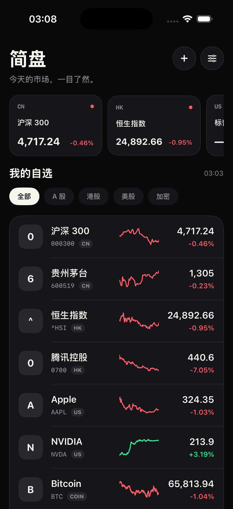
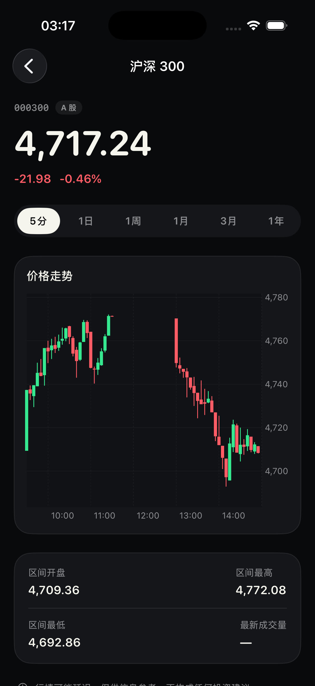

# 简盘 JianPan

一个专注“看价格”本身的原生 iOS 行情 App。覆盖 A 股、港股、美股与主流加密资产，保留自选、涨跌、迷你走势与 K 线这些真正高频的功能。

  
  

## 功能

- A 股、港股、美股、加密资产统一自选
- 5 分钟 K 线，以及 1 日、1 周、1 月、3 月、1 年区间
- 按市场筛选、本地中文名称 + 在线代码搜索、自定义代码添加
- 下拉刷新与本地行情缓存
- 无登录、无广告、无埋点
- 深色原生 SwiftUI 界面，支持 iPhone

## 安装到 iPhone

1. 安装 Xcode 16 或更新版本。
2. 用 Xcode 打开 `JianPan.xcodeproj`。
3. 在项目的 **Signing & Capabilities** 中选择你自己的 Apple Developer Team。
4. 连接 iPhone，选择设备后点击 Run。

免费 Apple ID 也可以进行个人设备调试安装，但签名有效期与可用能力以 Apple 当前规则为准。仓库不包含已签名 IPA，因为 iOS 安装包必须使用安装者自己的证书签名。

## 技术说明

- SwiftUI + Swift Charts
- 最低系统：iOS 17
- 无第三方依赖
- 行情层集中在 `YahooMarketService`，便于替换成持牌/商业数据源
- 标的搜索由本地中文名称、腾讯证券联想与 Yahoo Finance 搜索合并去重
- 自选与最近行情只保存在本机 `UserDefaults`

当前 MVP 通过 Yahoo Finance Chart 的公开网络接口读取行情，并通过腾讯证券与 Yahoo Finance 的公开搜索接口查找标的，不需要 API Key。这些接口并非为本项目提供 SLA 的商业服务，可能限流、延迟或调整；若用于 App Store 正式产品或交易决策，请替换为有授权和稳定性承诺的数据供应商。

## 数据代码示例

- A 股：`600519.SS`、`300750.SZ`
- 港股：`0700.HK`、`9988.HK`
- 美股：`AAPL`、`NVDA`
- 加密：`BTC-USD`、`ETH-USD`

## 风险提示

本项目只用于行情信息展示与学习，不构成投资建议。行情可能存在延迟、遗漏或误差，请勿将其作为交易下单的唯一依据。

## License

MIT
